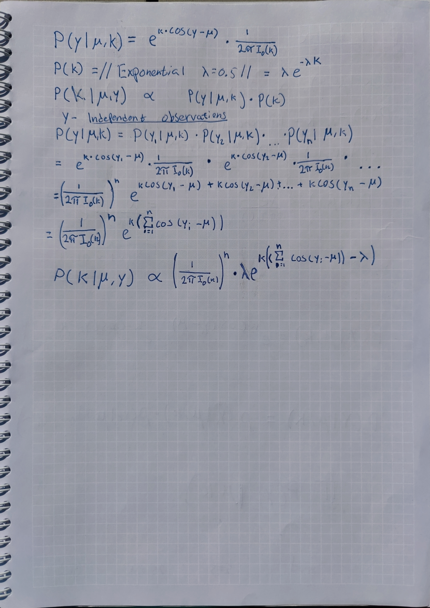
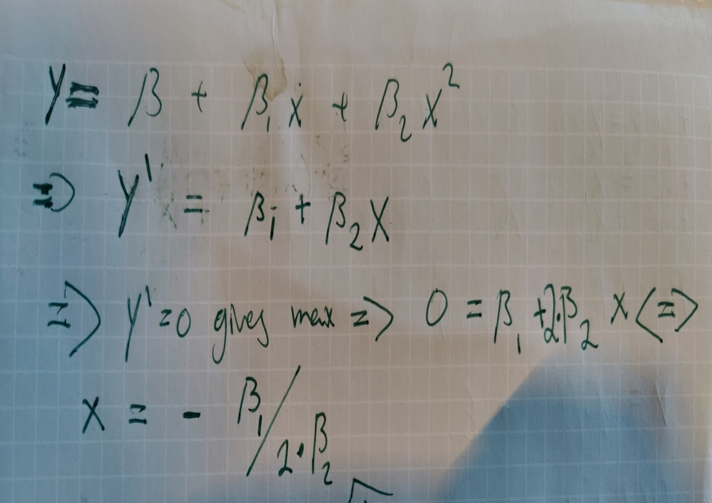

---
output:
  pdf_document: default
  html_document: default
---

# Lab 1

## Task 1

```{r "Lab 1 Task 1"}
n <- 70
s <- 22
f <- n - s
alfa <- 8
beta <- alfa

nDraws <- 10000
#The joint posterior of BETA(a,b) with likelihood bern(theta)
#is BETA(alfa ´+ s, beta + f).
posterior_alfa <- alfa + s
posterior_beta <- beta + f
#Draw from posterior using rbeta
posterior_draws <- as.vector(matrix(ncol = nDraws))
SD <- as.vector(matrix(ncol = nDraws))
E <- as.vector(matrix(ncol = nDraws))
for (n in 1:nDraws) 
{
  posterior_draws[n] <- rbeta(1, posterior_alfa, posterior_beta)
  SD[n] <- sd(posterior_draws[1:n])
  E[n] <- mean(posterior_draws[1:n])
}


#E[theta] of a beta distribution = alfa/(beta + alfa)
true_Exp <- posterior_alfa/(posterior_beta + posterior_alfa)
#V[theta] of a beta distribution = (alfa * beta) / ((alfa + beta)^2 * (alfa + beta + 1)
true_Var <- (posterior_alfa * posterior_beta) / ((posterior_alfa + posterior_beta)^2 * (posterior_alfa + posterior_beta + 1))
true_SD <- sqrt(true_Var)
plot(SD, main = "Standard deviation after x iterations",
     xlab = "# of iterations",
     col = "blue",
     type = 'l')
abline(h = true_SD, col = "red")
plot(E, main = "Mean value after x iterations",
     xlab = "# of iterations",
     col = "blue",
     type = 'l')
abline(h = true_Exp, col = "red")

################################################################
#b)

#pbeta returns p(theta < 0.3 | alfa, beta) -> use 1 - pbeta
pr_true <- (1 - pbeta(0.3,posterior_alfa, posterior_beta))

over <- 0 
under <- 0
for (n in 1:nDraws)
{
  if (posterior_draws[n] > 0.3)
  {
    over <- (over + 1)
  }
  else
  {
    under <- (under + 1)
  }
}
pr_sim <- (over / length(posterior_draws))
cat(pr_sim, pr_true)

################################################################
#c)
odds <- (posterior_draws / (1 - posterior_draws))
plot(density(odds))
hist(odds)
```

## Task 2

```{r "Lab 1 Task 2"}
monthly_income = c(33, 24, 48, 32, 55, 74, 23, 17) #Given
y <- monthly_income
n <- length(y)
mu <- 3.6 #Given
tau_2 <- (sum((log(y) - mu)^2) / n) #Given
nDraws <- 10000 #Given
draw_inv_chi <- function(nDraws, v, s)
{
    draws <- rchisq(nDraws, v)
    return( (v * s)/draws )
}
sigma2 <- draw_inv_chi(nDraws = nDraws, v = n, s = tau_2)

plot(density(sigma2), xlim = c(0,1),
     main = "Density function of sigma2")

################################################################
#b)
#pnorm gives the cummulativ distribution function (phi(x))
CDF <- pnorm( sqrt(sigma2) / sqrt(2) )
G <- ((2 * CDF) - 1)
plot(density(G), main = "Density funciton for Gini-Coef")


################################################################
#c)
lower <- quantile(G, 0.025)
upper <- quantile(G, 0.975)

plot(density(G), main = "Density funciton for Gini-Coef")
abline(v = lower, col = "red")
abline(v = upper, col = "red")
legend("topright", legend = c("Gini-distri", "Quantiles"),
       col = c("black", "red"), lty = 1)
################################################################
#d)
########################################################
## COULD BE DONE LIKE THIS
## library("bayestestR")
## interval = eti(G,0.95)
##
## sorted_G = sort(G)
## test = hdi(sorted_G, ci = 0.95)
##
## AND PLOTTED LIKE THIS
## plot(density(sorted_G), col = "blue",xlim=c(0,.8))
## abline(v= interval[2], col = "red")
## abline(v= interval[3], col = "red")
## abline(v= test[2], col = "green")
## abline(v= test[3], col = "green")
## OR LIKE BELOW
########################################################
kernel <- density(G)
kernel <- data.frame(kernel$y, kernel$x)
#sort the DF based on the Density. 
kernel <- kernel[order(kernel$kernel.y, decreasing = TRUE),]
tot_sum <- sum(kernel$kernel.y)
cum_dens <- 0.00000000000001
i <- 0
while ((cum_dens/tot_sum) < 0.95)
{
  i <- (i + 1)
  cum_dens <- cum_dens + kernel$kernel.y[i]
}

abline(v = max(kernel$kernel.x[1:i]), col = "blue")
abline(v = min(kernel$kernel.x[1:i]), col = "blue")

legend("topright", legend = c("Gini-distri", "Quantiles", "HPDI"),
       col = c("black", "red", "blue"), lty = 1)
```

## Task 3



```{r "Lab 1 Task 3"}
y <- c(-2.79, 2.33, 1.83, -2.44, 2.23, 2.33, 2.07, 2.02, 2.14, 2.54)
mu <- 2.4
lambda <- 0.5
k <- 6
denumerator <- function(k, n)
{
  return ( (2 * pi * besselI(k, 0))^n )
}
numerator <- function(k, y, mu, lambda)
{
  return (lambda * exp(k * (sum(cos(y- mu)) - lambda) ) )
}
#f(k)
posterior_draw_k <- function(lambda, k, mu, y)
{
  result <- c()
  for (k in seq(from = 0, to = k, by = 0.01))
  {
    result <- c(result, (numerator(k = k, y = y, mu = mu, lambda = lambda) / denumerator(k = k, n = length(y)) ))
  }
  return (result)
}

draws <- posterior_draw_k(k = k, y = y, mu = mu, lambda = lambda)
draws <- (draws * 100) / sum(draws) #Multiply by 100 to cancel out the grid stepsize
plot(x = seq(0, k, 0.01), y = draws,
     xlab = "k - value", ylab = "Density", 
     main = "Plot of the posterior density and mode",
     type = 'l')
posterior_mode <- max(draws)
abline(v = max(which.max(draws) / 100), col = "red")
legend("topright", legend = c("Posterior", "Mode"),
       col = c("black", "red"), lty = 1)

```

# Lab 2

```{r "Lab 2 Task 1"}
#install.packages("readxl")
library("readxl")
data <- as.data.frame(readxl::read_xlsx("C:/Users/albre/tdde07/lab2/Linkoping2022.xlsx", col_names = TRUE))
df <- data.frame(data$temp, c(1:365)/ 365)
colnames(df) <- c("temp", "time")


f_of_time <- function(x, beta, epsilon)
{
  return (x%*%beta + epsilon)
}

draw_inv_chi <- function(nDraws, v, s)
{
  draws <- rchisq(nDraws, v)
  return( as.numeric(v * s)/draws )
}
#install.packages("mvtnorm")
library("mvtnorm")
draw_prior_beta <- function(mu_0, sigma2, omega)
{
    return (MASS::mvrnorm(mu = mu_0,Sigma =  sigma2*solve(omega)))
}
#Mean temp for Jan 1st~ 1 degree. 21 Degrees for 31/06.
mu_0 <- c(1, 80, -80) 
#Prior confidence about the intercept is relatively high compared to the other.
omega_0 <- diag(c(2,0.1,0.1),3)
#Scaling parameter when obtaining sigma^2 for beta.
sigma_0 <- 1
#Degrees of freedom when sampling from the invCHISQ.
v_0 <- 1

sigma2 <- draw_inv_chi(nDraws = 1, v_0, sigma_0)


x <- matrix(ncol = 3, nrow = length(df$time))
x[,1] <- 1
x[,2] <- df$time
x[,3] <- df$time^2

temp <- matrix(nrow = 10, ncol = 365)
plot(df$temp)
for (i in 1:10)
{
beta <- draw_prior_beta(mu_0 = mu_0, sigma2 = sigma2, omega = omega_0)
temp[i,] <- t(f_of_time(x, beta, 0))
lines(temp[i,])
}

################################################################
#b)
#Update the parameters to get a posterior as in lecture 5
beta_hat <- solve(t(x)%*%x)%*%t(x)%*%df$temp
mu_n <- solve(t(x)%*%x + omega_0)%*%(t(x)%*%x%*%beta_hat + omega_0%*%mu_0)
omega_n <- t(x)%*%x + omega_0
v_n <- v_0 + length(df$time)
#sigma2_n is used to sample sigma2 from the chi-square
sigma2_n <- (sigma_0*v_0 + ((t(df$temp)%*%df$temp + t(mu_0)%*%omega_0%*%mu_0 - t(mu_n)%*%omega_n%*%mu_n))/v_n)

#Decide #Of draws
nDraws = 10^4

#Sample as many sigmas as there is in ndraws.
#These is then used when sampling from normal distribution to get beta
sigma_draws <- draw_inv_chi(v = v_n, s = sigma2_n, nDraws = nDraws)
#Sample as many betas as there are elements in the sigma vector
sample_betas <- function(u, sigmas, omega)
{
  temp <- matrix(nrow = length(sigmas), ncol = 3)
  for (i in 1:length(sigmas))
  {
    temp[i,] <- MASS::mvrnorm(n= 1, u, (sigmas[i]*solve(omega_n)))
  }
  return (temp)
}
beta_draws <- sample_betas(mu_n, sigma_draws, omega_n)


par(mfrow=c(2,2)) # Create a 2x2 grid of plots to plot the histograms
hist(beta_draws[,1], main="Histogram of beta0 posterior", xlab="beta0")
hist(beta_draws[,2], main="Histogram of beta1 posterior", xlab="beta1")
hist(beta_draws[,3], main="Histogram of beta2 posterior", xlab="beta2")
hist(sigma_draws, main="Histogram of sigma^2 posterior", xlab="sigma^2")
par(mfrow=c(1,1))


#Create a big matrix for the posterior estimations.
Y_big <- matrix(nrow = nDraws, ncol = nrow(df))
for (i in 1:nrow(Y_big))
{
  Y_big[i,] <- f_of_time(x, beta_draws[i,], epsilon = 0)
}

#Create vectors.
median <- vector(mode = "integer", length = nrow(df))
low_perc <- median
up_perc <- median

#Get median, Upper and Lower percentile
for (i in 1:nrow(df))
{
  median[i] <- median(Y_big[,i])
  low_perc[i] <- quantile(Y_big[,i], 0.05)
  up_perc[i] <- quantile(Y_big[,i], 0.95)
}
plot(x = df$time, y=median, type = 'l', col = "blue",
     ylab = "Temperature", xlab = "Time", main = "Plot with median, upper and lower quantile")
points(y = df$temp, x = df$time, col = "grey") 
lines(y = up_perc, x = df$time, col = "red") 
lines(y = low_perc, x = df$time, col = "red") 

#The confidence interval does not need to cover all 
# data points because it describes the uncertainty about f(time).

################################################################
#c)
x_tilde <- -(beta_draws[,2]/beta_draws[,3])*0.5
hist(x_tilde, main="Histogram of x_tilde", xlab="Time")

#Examples of mu_0, omega_0 for a greater poly.
#mu_10  <- c(1, 80, -80, 0, 0, 0, 0, 0, 0, 0, 0)
#omega_0_10 <- (diag(c(4,1 ,1 , 0.1, 0.1, 0.1, 0.1, 0.1, 0.1, 0.1, 0.1),11)) 
```

### Task 1 c:

By using calculus as seen below we could derive the expression below. We then used this expression to calculate X_tilde for all of our betas and got the histogram below. The result seems very reasonable since x = 0.535 is approximately 13th of July.



### Task 1d:

Since we "suspect that higher order terms may not be needed, and you worry about overfitting the data" we could select the mu_0 in such a way that the higher order has a low mean, here we choose it to be zero. Furthermore, the higher values we choose for the omega diagonal the higher variance we get around the chosen mu_0, and thus also putting less trust in our model and more to the data. Hence if we want to penalize the higher order we chose low values for the higher indexes.

```{r "Lab 2 Task 2"}
################################################################
#a)
library("mvtnorm")
library("bayestestR")
getwd()
WomenData = read.table("lab2/WomenAtWork.dat",sep = " ",header = T)
Y = WomenData[,1] # Work or No work (0, 1)
X = WomenData[,2:8] # Attributes

tao = 2 # From task
I_matrix = diag(7) # 7 variables, needed for b ~ N(*, *)

# Code from lecture 6, copypaste   
logistic_posterior <- function(initVal, y, X, mu, Sigma)
{
  linPred <- as.matrix(X)%*%initVal;
  logLik <- sum( linPred*y - log(1 + exp(linPred)) ); # Likelihood
  logPrior <- dmvnorm(initVal, mu, Sigma, log=TRUE); # Denisty multivariate normal, prior
  return(logLik + logPrior) 
}

initVal = rnorm(7) # Init the 7 random variable thetas using the normal distribution
mu <- as.matrix(rep(0,7)) # Prior mean vector is 0 from the task description
Sigma = (tao^2)*I_matrix # Sigma = the right value in b ~ N(*, *) from task description


# Send into the function from lecture 6
OptimRes <- optim(initVal,logistic_posterior,gr=NULL,Y,X,mu,Sigma,method=c("BFGS"),
                  control=list(fnscale=-1),hessian=TRUE)

# Posterior and approx posteriod std deviation from optim, same way as in 
# lecture 6 code
print("Posterior mode is")
OptimRes$par 
approxPostStd <- sqrt(diag(solve(-OptimRes$hessian)))
print('The approximate posterior standard deviation is:')
print(approxPostStd)

x_hat = mean(WomenData$NSmallChild) # Get the mean from the NSmallChild data
# 95% Confidence interval calculations from wikipedia 
ci = (1.96 * approxPostStd[6])/sqrt(nrow(WomenData)) 
ci_upper = x_hat + ci
ci_lower = x_hat - ci
ci_upper
ci_lower

# Comparison
glmModel<- glm(Work ~ 0 + ., data = WomenData, family = binomial)
print("Comparison")
print(glmModel$coefficients)
print(OptimRes$par)

# The confidence interval does not contain 0 which indicates that the variable
# is important. The values are almoost the same which means that the  
# approximation is reasonable

################################################################
#b)

# draw from the random multivariate norm using the means from the optim.
# The inverse hessian is the sigma for the approximation for the parameter vector
get_probability<- function(m,s){
  x = c(1,18,11,7,40,1,1)
  beta = rmvnorm(1000, mean =m , sigma = s)
  prob_1 = exp(t(as.matrix(x)) %*% t(beta)) / (1 + exp(t(as.matrix(x)) %*% t(beta)))
  # Logistic regression gives prob = 1, we want prob = 0 (1 - prob=1)
  prob_0 = 1 - prob_1 
}

# Probability logistic regression model from task description 
prob_0 = get_probability(OptimRes$par,-solve(OptimRes$hessian) ) 

plot(density(prob_0))

################################################################
#c)
nDraws <- 10000
multiplePred=c() 
m = OptimRes$par 
s =-solve(OptimRes$hessian) 
for (i in 1:nDraws) { 
  thetaPred = get_probability(m,s) 
  multiplePred=c(multiplePred, rbinom(1, 13, thetaPred)) 
} 
barplot(table(multiplePred),  
        main=paste("Predictive distribution for the number of women out of 11 that are working"), xlab="No. of women")
```

# Lab 3

```{r "Lab 3 Task 1"}
#The functions for sampling is created in line with the slides from the lectures, see org. hand-in.
################################################################
#a)
data <- readRDS("lab3/Precipitation.rds")
logdata <- log(data)

#Init Values
u_0 <- 2
t_0 <- 1
sigma_0 <- 1
v_0 <-  1

#Make a function to draw u 
draw_u <- function(u_0, t_0, sigma2, x_mean, N_of_x)
{
  w <- (N_of_x / sigma2) / ( (N_of_x / sigma2) + (1 / t_0) )
  t_n <- 1 / ( (N_of_x / sigma2) + (1 / t_0) )
  u_n <- (w * x_mean) + ((1 - w) * u_0)
  sample <- rnorm(1, u_n, sqrt(t_n))
  return (sample)
}

draw_inv_chi <- function(v, s)
{
  X <- 1 / rchisq(1,v)
  return (X * (v*s))
}

draw_sigma <- function(v_0, sigma_0, x, u)
{
  v_n <- (v_0 + length(x))
  scaler <- ((v_0 * sigma_0) + sum((x - u)^2)) / v_n
  return(draw_inv_chi(v_n, scaler))
}

#NMBR OF SAMPLES
N <- 1000
#Start values
u_samples <- matrix(ncol = 1, nrow = 1)
sigma_samples <- matrix(ncol = 1, nrow = 1)
u_start <- 3
sigma_start <- sigma_0
u_samples[1] <- u_0
sigma_samples[1] <- sigma_start

data_mean <- mean(logdata)
data_length <- length(logdata)

for (i in 2:(N*2))
{
  #If statement adds the old result for pretty printing 
  if(i %% 2 == 0)
  {
    u_samples[i] <- draw_u(u_0, t_0, sigma_samples[i-1], data_mean, data_length)
    sigma_samples[i] <- sigma_samples[i-1]
  }
  else
  {
    u_samples[i] <- u_samples[i-1]
    sigma_samples[i] <- draw_sigma(v_0, sigma_0, logdata, u_samples[i])  
  }
}

plot(u_samples, sigma_samples, type = 'l', main = "Gibbs sample 1000 iterations")
acf(u_samples)
acf(sigma_samples)
acf_u <- acf(u_samples, plot = FALSE)
acf_sigma2 <- acf(sigma_samples, plot = FALSE)
IF_u <- 1 + 2 * sum(acf_u$acf[-1])
IF_sigma2 <- 1 + 2 * sum(acf_sigma2$acf[-1])

plot(sigma_samples, type = 'l', col = 'red', 
     xlim = c(0, 1000), ylab = "Sample value",
     main = "Trajectories")
lines(u_samples, col = 'blue', type = 'l')
legend("topright", legend = c("sigma", "U"),
       col = c("red", "blue"), lty = 1)
################################################################
#b)
#Discard the first 100 samples when sampling using the draws from a)
y_draws <-  matrix(ncol = (N-100), nrow = 1)
for (i in 1:(N - 100))
{
  u <- u_samples[(2 * i) + 100]
  sd <- sqrt(sigma_samples[(2 * i) + 100])
  y_draws[i] <- exp(rnorm(1, u, sd))
}

#Make a historgram, and add density curves for the data and the posterior predictions.
#Below is the plot asked for with a histogram and kernel density for the
#observed data and density for the posterior predictions. As one can see
#the predictive and observed data has very similar density hence the
#posterior predictive density agree with the data.

hist(data, breaks = 20,
     freq = FALSE,
     main = "Histogram and Posterior Predictive Density",
     xlab = "Daily Precipitation", ylim = c(0,0.15))
lines(density(data), col = "red")
lines(density(y_draws), col = "blue")
legend("topright", legend = c("Observed Data", "Posterior Predictive Density"),
       col = c("red", "blue"), lty = 1)

```

```{r "Lab 3 Task2"}
################################################################
#a)
data = read.table('lab3/eBayNumberOfBidderData.dat', header = TRUE)
data_shaved = data
#Remove intercept (const = 1)
data_shaved[2] = NULL

#create a poisson regression model, then print it
a_model = glm(nBids~., data = data_shaved, family = "poisson")
a_model
summary(a_model)
# Significant covariates has a low Pr(>|z|) value
# Most impactful variable is MinBidShare

################################################################
#b)
library("mvtnorm")
library("bayestestR")

poisson_posterior <- function(initVal, y, X, mu, Sigma)
{
  lambda <- exp(as.matrix(X)%*%initVal);
  loglik <- sum(dpois(y,lambda, log = TRUE)); 
  logPrior <- dmvnorm(initVal, mu, Sigma, log=TRUE); # Denisty multivariate normal
  return(loglik + logPrior) 
  
}


initval = rnorm(9)
Y  = data$nBids
X  = data[,2:10]
mean = as.matrix(rep(0,9))
Sigma = 100* solve(t(as.matrix(X))%*%as.matrix(X))

OptimRes <- optim(initval,poisson_posterior,gr=NULL,Y,X,mean,Sigma,method=c("BFGS"),
                  control=list(fnscale=-1),hessian=TRUE)
OptimRes$par
a_model$coefficients

################################################################
#c)
hessian = solve(-OptimRes$hessian)
post_mode = OptimRes$par
posterior_beta_theta0 = rmvnorm(1, post_mode, hessian)

LogPostPoissonBeta <- function(beta, Sigma, mu, y, x)
{
  lambda_k  = (y * (beta %*% t(as.matrix(x))))
  e_lambda = (exp(beta %*% t(as.matrix(x)) ))
  k_factorial = (log(factorial(y)) )
  loglik <-sum( lambda_k - e_lambda - k_factorial)
  logprior <- dmvnorm(beta,mu,Sigma, log = TRUE)
  return (loglik + logprior)
}


RWMSampler <- function(funct_object, iterations, c, Hessian, Post_mode, Sigma, mu, Y,X)
{
  sample_matrix = matrix(1, iterations, 9)
  not_acc = 0
  acc = 1
  for (i in 2:iterations)
  {
    logsample_prev_p = funct_object(sample_matrix[i-1,],Sigma, mu,Y,X)
    
    sample = rmvnorm(1, mean = sample_matrix[i-1,], sigma = Hessian * c)
    logsample_p = funct_object(sample, Sigma, mu, Y,X)
    alpha = min(1,exp(logsample_p-logsample_prev_p))
    random = runif(1, min=0, max=1)
    if(alpha < random)
    {
      sample_matrix[i,] = sample_matrix[i-1,]
      not_acc = not_acc + 1
    }
    else
    {
      sample_matrix[i,] = sample
      acc = acc + 1
    }
    
  }
  
  print(acc/(acc+not_acc))
  return (sample_matrix)
}
#Tuning Parameter
c=0.1
iterations = 10000
sample_matrix<- RWMSampler(LogPostPoissonBeta, iterations,c,hessian,post_mode, Sigma, mean, Y,X)

for(i in 1:9){
  plot(sample_matrix[,i], type = "l")
  abline(h=post_mode[i],col = "blue")
}
# Stabelizes after 2000 ish
# Seems to converge to values we got from optim.

################################################################
#d)
characteristics = c(0, 1,0,1,0,1,0,1.2,0.8) 
after_burnout <- sample_matrix[2001:10000,] # Decided from C 
lambda = exp(after_burnout %*% characteristics) 
dist = rpois(1000, lambda) 
no_bidders = 0 
bidders = 0 
for (i in 1:length(dist)) 
{ 
  if(dist[i] == 0) 
  { 
    no_bidders = no_bidders + 1 
  } 
  else 
  { 
    bidders = bidders + 1 
  } 
} 
#Delen genom det hela  -> procent.
print(no_bidders/(no_bidders+bidders))


```

```{r "Lab 3 Task 3"}
mu = 13
sigma_sq = 3
big_T = 300
phi = 0.1

x_one = mu

AR_1 <- function(big_T,x_one,sigma_sq,mu,phi)
{
  x_matrix = matrix(0,nrow=big_T,ncol=1)
  x_matrix[1] = x_one
  for (i in 2:big_T)
  {
    e = rnorm(1,0,sigma_sq)
    x = mu + phi*(x_matrix[i-1] - mu) + e
    x_matrix[i] = x
  }
  plot(x_matrix)
  title(c("phi:",phi))
  abline(h=16, col = "blue") # Upper
  abline(h=10, col = "blue") # Lower
  abline(h=13, col = "red") # Mean
  return (x_matrix)
}

# Phi = 0.95
AR_1(big_T, x_one,sigma_sq,mu,phi=0.95)
# Phi = 0.5
AR_1(big_T, x_one,sigma_sq,mu,phi=0.50)
# Phi = 0.1
AR_1(big_T, x_one,sigma_sq,mu,phi=0.10)
# Phi = -0.95
AR_1(big_T, x_one,sigma_sq,mu,phi=-0.95)
# Phi = -0.5
AR_1(big_T, x_one,sigma_sq,mu,phi=-0.50)
# Phi = -0.95
AR_1(big_T, x_one,sigma_sq,mu,phi=-0.10)


# B
x = as.vector(AR_1(big_T, x_one,sigma_sq,mu,phi=0.20))
y = as.vector(AR_1(big_T, x_one,sigma_sq,mu,phi=0.95))

# Treat mu, sigma_sq and phi as unknown. 

library("rstan") # observe startup messages
#options(mc.cores = parallel::detectCores())
rstan_options(auto_write = TRUE)

input_data_y <- list(N = length(y), 
                    y = y)
input_data_x <- list(N = length(y), 
                     y = x)

warmup <- 1000
niter <- 2000

fit_y <- stan(file = 'lab3/Lab_3.stan', data = input_data_y, warmup=warmup, iter=niter, chains=4, cores=1)
fit_x <- stan(file = 'lab3/Lab_3.stan', data = input_data_x, warmup=warmup, iter=niter, chains=4, cores=1)

#Posterior mean & Credible intervals.
print(fit_y)
print(fit_x)
plot(fit_x)
plot(fit_y)


posterior_samples_y <- as.matrix(fit_y)
posterior_samples_x <- as.matrix(fit_x)

#Effective sample size
library(coda)
effectiveSize(posterior_samples_x)
effectiveSize(posterior_samples_y)


true_muy <-mean(y)
true_mux <-mean(x)
true_phi_y <- 0.95
true_phi_x <- 0.20
true_sigma2_y <- var(y)
true_sigma2_x <- var(x)


plot(posterior_samples_x[,1], type = 'l', main = "posterior for mu, where prev phi = 0.20", col = "blue", ylim = c(7, 14))
abline(h = true_mux, col = "red")
plot(posterior_samples_x[,2], type = 'l', main = "posterior for phi, where prev phi = 0.20", col = "blue")
abline(h = true_phi_x, col = "red")

plot(posterior_samples_y[,1], type = 'l', main = "posterior for mu, where prev phi = 0.95", col = "blue", ylim = c(0, 14))
abline(h = true_muy, col = "red")
plot(posterior_samples_y[,2], type = 'l', main = "posterior for phi, where prev phi = 0.95", col = "blue")
abline(h = true_phi_y, col = "red")

```
