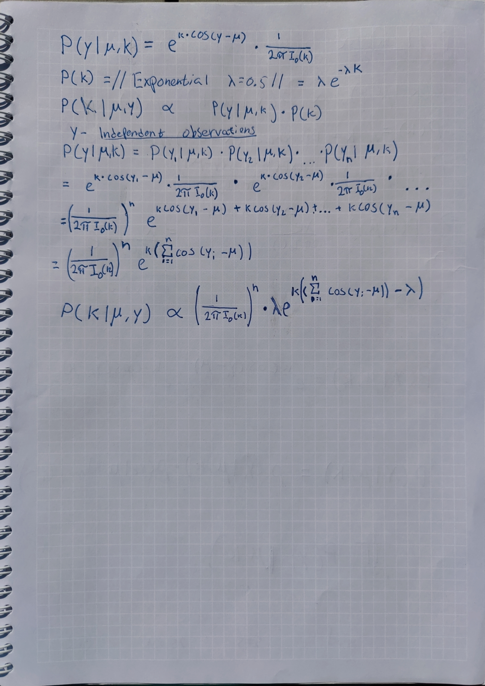

---
output:
  pdf_document: default
  html_document: default
---

# Lab 1

## Task 1

```{r "Lab 1 Task 1"}
n <- 70
s <- 22
f <- n - s
alfa <- 8
beta <- alfa

nDraws <- 10000
#The joint posterior of BETA(a,b) with likelihood bern(theta)
#is BETA(alfa ´+ s, beta + f).
posterior_alfa <- alfa + s
posterior_beta <- beta + f
#Draw from posterior using rbeta
posterior_draws <- as.vector(matrix(ncol = nDraws))
SD <- as.vector(matrix(ncol = nDraws))
E <- as.vector(matrix(ncol = nDraws))
for (n in 1:nDraws) 
{
  posterior_draws[n] <- rbeta(1, posterior_alfa, posterior_beta)
  SD[n] <- sd(posterior_draws[1:n])
  E[n] <- mean(posterior_draws[1:n])
}


#E[theta] of a beta distribution = alfa/(beta + alfa)
true_Exp <- posterior_alfa/(posterior_beta + posterior_alfa)
#V[theta] of a beta distribution = (alfa * beta) / ((alfa + beta)^2 * (alfa + beta + 1)
true_Var <- (posterior_alfa * posterior_beta) / ((posterior_alfa + posterior_beta)^2 * (posterior_alfa + posterior_beta + 1))
true_SD <- sqrt(true_Var)
plot(SD, main = "Standard deviation after x iterations",
     xlab = "# of iterations",
     col = "blue",
     type = 'l')
abline(h = true_SD, col = "red")
plot(E, main = "Mean value after x iterations",
     xlab = "# of iterations",
     col = "blue",
     type = 'l')
abline(h = true_Exp, col = "red")

################################################################
#b)

#pbeta returns p(theta < 0.3 | alfa, beta) -> use 1 - pbeta
pr_true <- (1 - pbeta(0.3,posterior_alfa, posterior_beta))

over <- 0 
under <- 0
for (n in 1:nDraws)
{
  if (posterior_draws[n] > 0.3)
  {
    over <- (over + 1)
  }
  else
  {
    under <- (under + 1)
  }
}
pr_sim <- (over / length(posterior_draws))
cat(pr_sim, pr_true)

################################################################
#c)
odds <- (posterior_draws / (1 - posterior_draws))
plot(density(odds))
hist(odds)
```

## Task 2

```{r "Lab 1 Task 2"}
monthly_income = c(33, 24, 48, 32, 55, 74, 23, 17) #Given
y <- monthly_income
n <- length(y)
mu <- 3.6 #Given
tau_2 <- (sum((log(y) - mu)^2) / n) #Given
nDraws <- 10000 #Given
draw_inv_chi <- function(nDraws, v, s)
{
    draws <- rchisq(nDraws, v)
    return( (v * s)/draws )
}
sigma2 <- draw_inv_chi(nDraws = nDraws, v = n, s = tau_2)

plot(density(sigma2), xlim = c(0,1),
     main = "Density function of sigma2")

################################################################
#b)
#pnorm gives the cummulativ distribution function (phi(x))
CDF <- pnorm( sqrt(sigma2) / sqrt(2) )
G <- ((2 * CDF) - 1)
plot(density(G), main = "Density funciton for Gini-Coef")


################################################################
#c)
lower <- quantile(G, 0.025)
upper <- quantile(G, 0.975)

plot(density(G), main = "Density funciton for Gini-Coef")
abline(v = lower, col = "red")
abline(v = upper, col = "red")
legend("topright", legend = c("Gini-distri", "Quantiles"),
       col = c("black", "red"), lty = 1)
################################################################
#d)
########################################################
## COULD BE DONE LIKE THIS
## library("bayestestR")
## interval = eti(G,0.95)
##
## sorted_G = sort(G)
## test = hdi(sorted_G, ci = 0.95)
##
## AND PLOTTED LIKE THIS
## plot(density(sorted_G), col = "blue",xlim=c(0,.8))
## abline(v= interval[2], col = "red")
## abline(v= interval[3], col = "red")
## abline(v= test[2], col = "green")
## abline(v= test[3], col = "green")
## OR LIKE BELOW
########################################################
kernel <- density(G)
kernel <- data.frame(kernel$y, kernel$x)
#sort the DF based on the Density. 
kernel <- kernel[order(kernel$kernel.y, decreasing = TRUE),]
tot_sum <- sum(kernel$kernel.y)
cum_dens <- 0.00000000000001
i <- 0
while ((cum_dens/tot_sum) < 0.95)
{
  i <- (i + 1)
  cum_dens <- cum_dens + kernel$kernel.y[i]
}

abline(v = max(kernel$kernel.x[1:i]), col = "blue")
abline(v = min(kernel$kernel.x[1:i]), col = "blue")

legend("topright", legend = c("Gini-distri", "Quantiles", "HPDI"),
       col = c("black", "red", "blue"), lty = 1)
```

## Task 3



```{r "Lab 1 Task 3"}
y <- c(-2.79, 2.33, 1.83, -2.44, 2.23, 2.33, 2.07, 2.02, 2.14, 2.54)
mu <- 2.4
lambda <- 0.5
k <- 6
denumerator <- function(k, n)
{
  return ( (2 * pi * besselI(k, 0))^n )
}
numerator <- function(k, y, mu, lambda)
{
  return (lambda * exp(k * (sum(cos(y- mu)) - lambda) ) )
}
#f(k)
posterior_draw_k <- function(lambda, k, mu, y)
{
  result <- c()
  for (k in seq(from = 0, to = k, by = 0.01))
  {
    result <- c(result, (numerator(k = k, y = y, mu = mu, lambda = lambda) / denumerator(k = k, n = length(y)) ))
  }
  return (result)
}

draws <- posterior_draw_k(k = k, y = y, mu = mu, lambda = lambda)
draws <- (draws * 100) / sum(draws) #Multiply by 100 to cancel out the grid stepsize
plot(x = seq(0, k, 0.01), y = draws,
     xlab = "k - value", ylab = "Density", 
     main = "Plot of the posterior density and mode",
     type = 'l')
posterior_mode <- max(draws)
abline(v = max(which.max(draws) / 100), col = "red")
legend("topright", legend = c("Posterior", "Mode"),
       col = c("black", "red"), lty = 1)

```

# Lab 2

```{r "Lab 2 Task 1"}
#install.packages("readxl")
library("readxl")
data <- as.data.frame(readxl::read_xlsx("C:/Users/albre/tdde07/lab2/Linkoping2022.xlsx", col_names = TRUE))
df <- data.frame(data$temp, c(1:365)/ 365)
colnames(df) <- c("temp", "time")


f_of_time <- function(x, beta, epsilon)
{
  return (x%*%beta + epsilon)
}

draw_inv_chi <- function(nDraws, v, s)
{
  draws <- rchisq(nDraws, v)
  return( as.numeric(v * s)/draws )
}
#install.packages("mvtnorm")
library("mvtnorm")
draw_prior_beta <- function(mu_0, sigma2, omega)
{
    return (MASS::mvrnorm(mu = mu_0,Sigma =  sigma2*solve(omega)))
}
#Mean temp for Jan 1st~ 1 degree. 21 Degrees for 31/06.
mu_0 <- c(1, 80, -80) 
#Prior confidence about the intercept is relatively high compared to the other.
omega_0 <- diag(c(2,0.1,0.1),3)
#Scaling parameter when obtaining sigma^2 for beta.
sigma_0 <- 1
#Degrees of freedom when sampling from the invCHISQ.
v_0 <- 1

sigma2 <- draw_inv_chi(nDraws = 1, v_0, sigma_0)


x <- matrix(ncol = 3, nrow = length(df$time))
x[,1] <- 1
x[,2] <- df$time
x[,3] <- df$time^2

temp <- matrix(nrow = 10, ncol = 365)
plot(df$temp)
for (i in 1:10)
{
beta <- draw_prior_beta(mu_0 = mu_0, sigma2 = sigma2, omega = omega_0)
temp[i,] <- t(f_of_time(x, beta, 0))
lines(temp[i,])
}

################################################################
#b)
#Update the parameters to get a posterior as in lecture 5
beta_hat <- solve(t(x)%*%x)%*%t(x)%*%df$temp
mu_n <- solve(t(x)%*%x + omega_0)%*%(t(x)%*%x%*%beta_hat + omega_0%*%mu_0)
omega_n <- t(x)%*%x + omega_0
v_n <- v_0 + length(df$time)
#sigma2_n is used to sample sigma2 from the chi-square
sigma2_n <- (sigma_0*v_0 + ((t(df$temp)%*%df$temp + t(mu_0)%*%omega_0%*%mu_0 - t(mu_n)%*%omega_n%*%mu_n))/v_n)

#Decide #Of draws
nDraws = 10^4

#Sample as many sigmas as there is in ndraws.
#These is then used when sampling from normal distribution to get beta
sigma_draws <- draw_inv_chi(v = v_n, s = sigma2_n, nDraws = nDraws)
#Sample as many betas as there are elements in the sigma vector
sample_betas <- function(u, sigmas, omega)
{
  temp <- matrix(nrow = length(sigmas), ncol = 3)
  for (i in 1:length(sigmas))
  {
    temp[i,] <- MASS::mvrnorm(n= 1, u, (sigmas[i]*solve(omega_n)))
  }
  return (temp)
}
beta_draws <- sample_betas(mu_n, sigma_draws, omega_n)


par(mfrow=c(2,2)) # Create a 2x2 grid of plots to plot the histograms
hist(beta_draws[,1], main="Histogram of beta0 posterior", xlab="beta0")
hist(beta_draws[,2], main="Histogram of beta1 posterior", xlab="beta1")
hist(beta_draws[,3], main="Histogram of beta2 posterior", xlab="beta2")
hist(sigma_draws, main="Histogram of sigma^2 posterior", xlab="sigma^2")
par(mfrow=c(1,1))


#Create a big matrix for the posterior estimations.
Y_big <- matrix(nrow = nDraws, ncol = nrow(df))
for (i in 1:nrow(Y_big))
{
  Y_big[i,] <- f_of_time(x, beta_draws[i,], epsilon = 0)
}

#Create vectors.
median <- vector(mode = "integer", length = nrow(df))
low_perc <- median
up_perc <- median

#Get median, Upper and Lower percentile
for (i in 1:nrow(df))
{
  median[i] <- median(Y_big[,i])
  low_perc[i] <- quantile(Y_big[,i], 0.05)
  up_perc[i] <- quantile(Y_big[,i], 0.95)
}
plot(x = df$time, y=median, type = 'l', col = "blue",
     ylab = "Temperature", xlab = "Time", main = "Plot with median, upper and lower quantile")
points(y = df$temp, x = df$time, col = "grey") 
lines(y = up_perc, x = df$time, col = "red") 
lines(y = low_perc, x = df$time, col = "red") 

#The confidence interval does not need to cover all 
# data points because it describes the uncertainty about f(time).

################################################################
#c)
x_tilde <- -(beta_draws[,2]/beta_draws[,3])*0.5
hist(x_tilde, main="Histogram of x_tilde", xlab="Time")

#Examples of u_0, omega_0 for a greater poly.
#u_10  <- c(1, 80, -80, 0, 0, 0, 0, 0, 0, 0, 0)
#omega_0_10 <- (diag(c(4,1 ,1 , 0.1, 0.1, 0.1, 0.1, 0.1, 0.1, 0.1, 0.1),11)) 
```

# 
